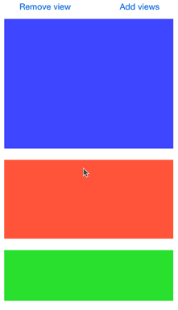

# BVViewList

BVViewList is a simpler version of UITableView. It lets you easily add and remove views, providing subtle animations along the way. Works with iOS 6/7.

## What it looks like


## Installation

BVViewList is available through [CocoaPods](http://cocoapods.org). To install
it, simply add the following line to your Podfile:

    pod "BVViewList"

## Usage
1. Import:

    `#import "BVViewList.h"`

2. Initialize BVViewList with one of the following methods:

	```
	- (instancetype)init;
	- (instancetype)initWithFrame:(CGRect)frame;
	- (instancetype)initWithFrame:(CGRect)frame view: (UIView *) view;
	- (instancetype)initWithFrame:(CGRect)frame views: (NSArray *) views;
	```
3. BVViewList has the following properties: 

	```
	@property (nonatomic, readonly) NSArray *views;
	@property (nonatomic) NSInteger innerViewSpacing; //defaults to 20
	@property (nonatomic) NSInteger titleIndent; //defaults to 10
	@property (nonatomic) NSInteger titleHeight; //defaults to 25
	@property (nonatomic) UIFont *titleFont; //defaults to UIFontTextStyleSubheadline
	```

- Initializing BVViewList with views will not let you change the innerViewSpacing of those views from the default. If you want to do that, add the views after initialization.

## Modifying the list
### Inserting views

Inserting views is easy. You can add just one or many using the following methods:
```
- (void)insertView:(UIView *)view atIndex:(NSUInteger)idx animated:(BOOL) animated;
- (void)insertViews:(NSArray *)views atIndex:(NSUInteger)idx animated:(BOOL) animated;
```
- `insertViews:atIndex:animated:` will insert all the views at ONE index.

### Removing views

Removing views is also easy!

#####Removing just one view:
	- (void)removeViewAtIndex:(NSUInteger)idx animated:(BOOL) animated;

#####Removing multiple views::
	- (void)removeViewsAtIndexes:(NSMutableIndexSet *)indexes animated:(BOOL) animated;
- Create an NSMutableIndexSet (e.g. `NSMutableIndexSet *indexSet = [NSMutableIndexSet indexSetWithIndexesInRange:NSMakeRange(1, 2)];`)
- Notice: the animation when removing multiple views, especially if they are both visible, is a bit funky. I'll try to fix it, but it's not too bad right now.

## Titles
### Adding titles

To add a title to a specific view, use:
```
- (void)addTitle:(NSString*)title withBackgroundColor:(UIColor*)backgroundColor toView:(UIView*)view animated:(BOOL)animated;
```
- setting the `backgroundColor` to `nil` will default to `[UIColor lightGrayColor]`

## Contributions
All pull requests welcome!

## License

Copyright (c) 2014 Bogdan Vitoc <vitocdev@gmail.com>

Permission is hereby granted, free of charge, to any person obtaining a copy
of this software and associated documentation files (the "Software"), to deal
in the Software without restriction, including without limitation the rights
to use, copy, modify, merge, publish, distribute, sublicense, and/or sell
copies of the Software, and to permit persons to whom the Software is
furnished to do so, subject to the following conditions:

The above copyright notice and this permission notice shall be included in
all copies or substantial portions of the Software.

THE SOFTWARE IS PROVIDED "AS IS", WITHOUT WARRANTY OF ANY KIND, EXPRESS OR
IMPLIED, INCLUDING BUT NOT LIMITED TO THE WARRANTIES OF MERCHANTABILITY,
FITNESS FOR A PARTICULAR PURPOSE AND NONINFRINGEMENT. IN NO EVENT SHALL THE
AUTHORS OR COPYRIGHT HOLDERS BE LIABLE FOR ANY CLAIM, DAMAGES OR OTHER
LIABILITY, WHETHER IN AN ACTION OF CONTRACT, TORT OR OTHERWISE, ARISING FROM,
OUT OF OR IN CONNECTION WITH THE SOFTWARE OR THE USE OR OTHER DEALINGS IN
THE SOFTWARE.

